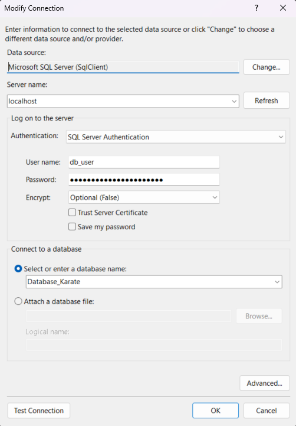

## How to create Database in SQL Server

- start Docker Desktop
- open Terminal

#### Pull image from Docker Hub and run container
```bash
docker pull mcr.microsoft.com/mssql/server:2022-latest

docker run -e "ACCEPT_EULA=Y" -e "MSSQL_SA_PASSWORD=Database.net.2023" -p 1433:1433 --name sqlserver-db-dotnet --hostname dotnet -d  mcr.microsoft.com/mssql/server:2022-latest

docker exec -it sqlserver-db-dotnet "bash"

/opt/mssql-tools/bin/sqlcmd -S localhost -U SA -P Database.net.2023
```
#### Create Database and User
```sql
CREATE DATABASE Database_Karate;
GO
USE Database_Karate;
GO
CREATE LOGIN db_user WITH PASSWORD = "Database.net.user.2023";
GO
CREATE USER db_user FOR LOGIN db_user
GO
ALTER ROLE db_datareader ADD MEMBER db_user
GO
ALTER ROLE db_datawriter ADD MEMBER db_user
GO
QUIT
```
#### Connect to Database in Visual Studio
```
In Visual Studio IDE
Click View 
=> Server Explorer 
=> Add Connection 

Data source:    Microsoft SQL Server 
Server Name:    localhost
Authentication: SQL Server Authentication
User Name:      db_user
Password:       Database.net.user.2023
Encrypt:        False
Database Name:  Database_Karate

Click Test Connection
Click OK
```



### Connection String
```
Data Source=localhost;Initial Catalog=Database_Karate;User ID=db_user;Password=Database.net.user.2023;Encrypt=False;MultipleActiveResultSets=True;TrustServerCertificate=True"
```

## Nuget Packages
```
EntityFrameworkCore
EntityFrameworkCore.SqlServer
EntityFrameworkCore.Tools
EntityFrameworkCore.Relational
```